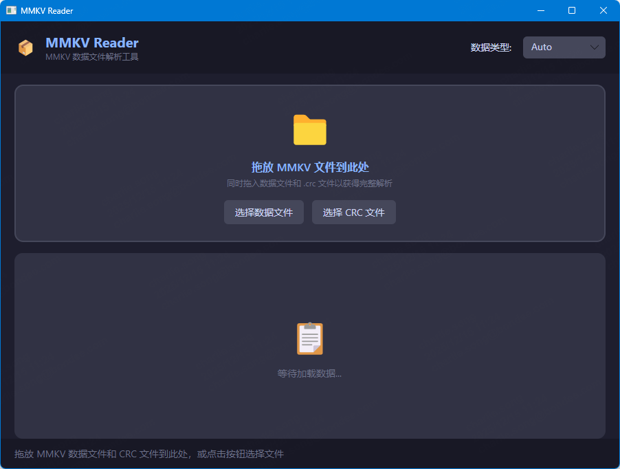
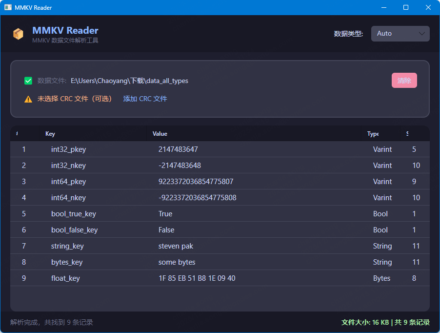
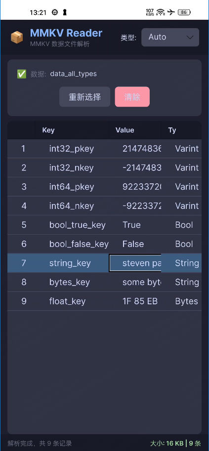

# MMKV Reader

[](https://dotnet.microsoft.com/)
[](https://avaloniaui.net/)
[](LICENSE)

基于 [Avalonia UI](https://avaloniaui.net/) 的跨平台 MMKV 数据文件解析工具，灵感来源于 [pengwei1024/MMKVReader](https://github.com/pengwei1024/MMKVReader)。

## 功能特性

- 🖥️ **跨平台支持** - Windows、macOS、Linux
- 📁 **拖放支持** - 直接拖放 MMKV 数据文件和 CRC 文件
- 🔍 **多类型解析** - 支持 Auto/String/Int32/Int64/Float/Double/Bool/Bytes
- 🌙 **深色主题** - 现代化的深色界面设计
- 📊 **数据表格** - 清晰展示解析后的键值对数据

## 截图
|  |  |  |
|:---:|:---:|:---:|
|  |  |  |

## 使用方法

### 方式一：拖放文件

将 MMKV 数据文件（和可选的 .crc 文件）直接拖放到应用窗口。

### 方式二：选择文件

点击「选择数据文件」按钮选择 MMKV 文件。

### 数据类型

使用右上角的下拉框选择数据解析类型：

- **Auto** - 自动检测类型（默认）
- **String** - 字符串
- **Int32/Int64** - 整数
- **Float/Double** - 浮点数
- **Bool** - 布尔值
- **Bytes** - 十六进制字节

## 构建运行

### 环境要求

- [.NET 9.0 SDK](https://dotnet.microsoft.com/download/dotnet/9.0)

### 运行

```bash
# 克隆仓库
git clone https://github.com/YOUR_USERNAME/AvaloniaMMKVReader.git
cd AvaloniaMMKVReader

# 运行桌面版
dotnet run --project AvaloniaMMKVReader.Desktop
```

### 发布

```bash
# Windows
dotnet publish AvaloniaMMKVReader.Desktop -c Release -r win-x64 --self-contained

# macOS
dotnet publish AvaloniaMMKVReader.Desktop -c Release -r osx-x64 --self-contained

# Linux
dotnet publish AvaloniaMMKVReader.Desktop -c Release -r linux-x64 --self-contained
```

## 项目结构

```
AvaloniaMMKVReader/
├── AvaloniaMMKVReader/           # 核心库
│   ├── Models/                   # 数据模型
│   ├── Services/                 # MMKV 解析服务
│   ├── ViewModels/               # MVVM 视图模型
│   └── Views/                    # UI 视图
├── AvaloniaMMKVReader.Desktop/   # 桌面应用入口
├── AvaloniaMMKVReader.Android/   # Android 平台（需要 workload）
├── AvaloniaMMKVReader.iOS/       # iOS 平台（需要 workload）
└── AvaloniaMMKVReader.Browser/   # Web 平台
```

## 关于 MMKV

[MMKV](https://github.com/Tencent/MMKV) 是腾讯开源的高性能 key-value 存储框架，广泛用于移动端应用。本工具可以解析 MMKV 生成的数据文件，方便开发调试。

## 许可证

MIT License

## 致谢

- [Avalonia UI](https://avaloniaui.net/) - 跨平台 UI 框架
- [pengwei1024/MMKVReader](https://github.com/pengwei1024/MMKVReader) - 原始 macOS 版本
- [Tencent/MMKV](https://github.com/Tencent/MMKV) - MMKV 存储框架
